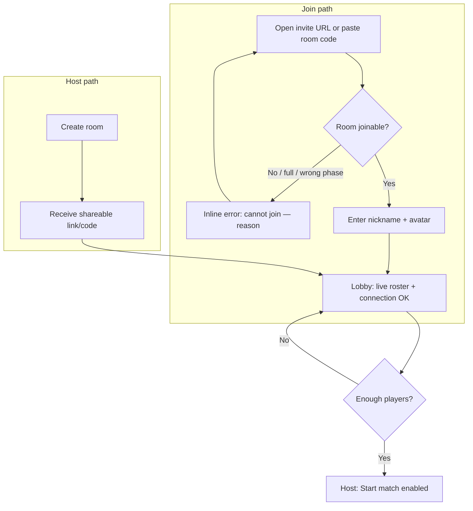
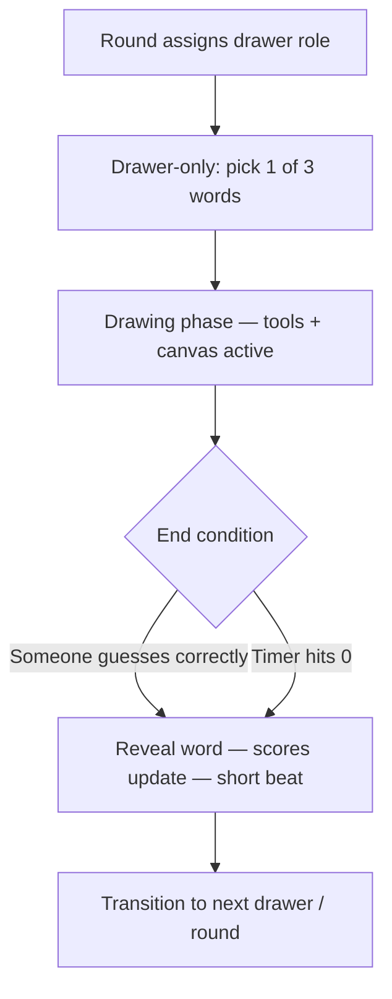
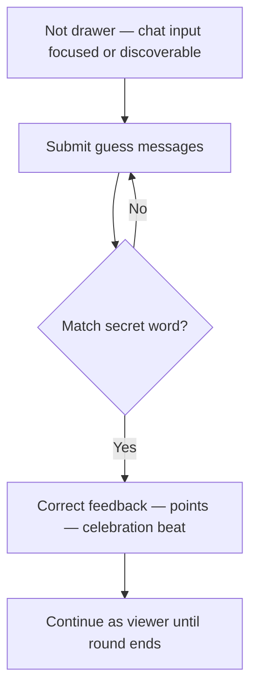
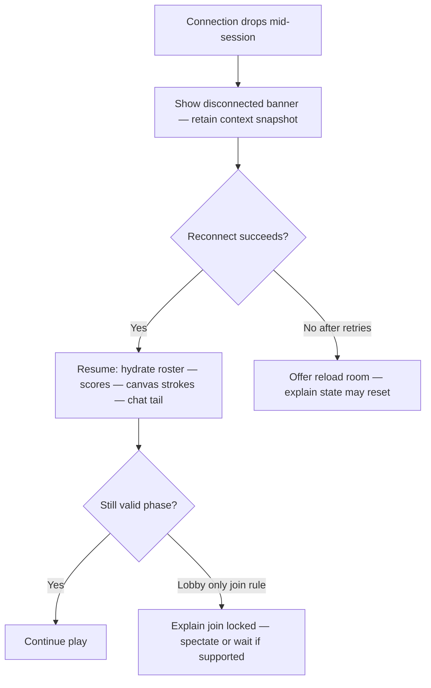
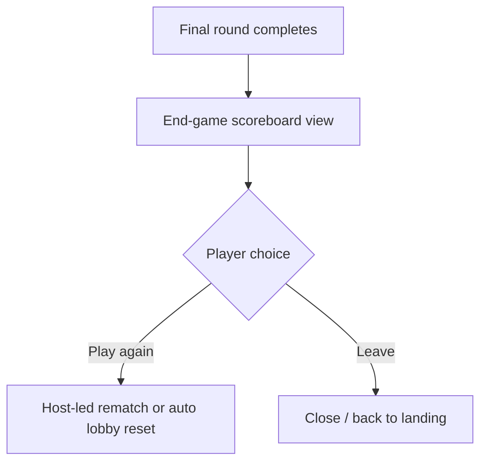

# UX Design Specification skribbl

**Author:** Femil
**Date:** 2026-04-29

---

<!-- UX design content will be appended sequentially through collaborative workflow steps -->

## Executive Summary

### Project Vision

Skribbl is a web-party draw-and-guess game optimized for **instant multiplayer**: one drawer on a shared canvas, everyone else guesses in chat, with rotating turns and score-driven momentum. The product thesis pairs **genre-familiar fun** with **demonstrable engineering**: low-friction rooms, strict real-time feel, and UI that stays readable under chat + canvas + tools + timer at once.

### Target Players

- **Portfolio reviewers (primary):** Engineers and hiring stakeholders evaluating architecture, latency behavior, and UI discipline in short sessions.
- **Social players (secondary):** Friends seeking quick sessions without accounts or installs; expectations are shaped by Skribbl.io-style norms but with room for clearer pacing and feedback.

### Key Design Challenges

- **Synchronize mental models:** Everyone must always know phase (lobby, picking word, drawing, scoring) and **who may act**.
- **Reduce split attention cost:** Toolbar, canvas, chat, and timer compete for focus — hierarchy and spacing matter as much as animation.
- **Resilience without panic:** Disconnect, reconnect, and blocked-WebSocket states must stay understandable and calm.

### Design Opportunities

- **Purposeful polish:** Timer urgency, guess celebrations, and tool feedback signal quality without decorative noise.
- **Reviewer-friendly shell:** Obvious structure, consistent components, and transparent errors reinforce the “production-ready” story.
- **Inclusive clarity:** Strong contrast and non-color-only cues for critical states where practical.

## Core Player Experience

### Defining Experience

The core loop is **guess in chat while one player draws on a shared canvas**, under a fixed timer, with **rotating drawers** and **speed-based scoring**. The defining interaction is **real-time alignment**: every participant must share the same mental model of phase (lobby → word choice → draw → resolve) and see strokes and chat updates without wondering whether the app is “stuck.” For guessers, the dominant action is **typing**; for the drawer, **painting** with immediate tool access — both mediated by **clear ownership** of input at each moment.

### Platform Strategy

- **Primary:** Modern **desktop browsers** (Chrome, Firefox, Safari, Edge) — **mouse** drawing, **keyboard** chat.
- **Web app:** Single-page experience with **WebSocket** required for live play; **no offline mode** for core gameplay.
- **Responsive:** Layout may adapt viewports, but **drawing fidelity targets desktop**; coordinate mapping must stay accurate if scaled.
- **Stretch:** Broader touch drawing is explicitly non-core for MVP — UX specs prioritize pointer precision and toolbar hit targets for desktop.

### Effortless Interactions

- **Join and identify:** Paste link or code → choose nickname/avatar → see lobby roster update live without refresh.
- **Drawer:** Pick **one of three** words quickly; switch colors/sizes/eraser/fill/clear without hunting.
- **Guessers:** Focus stays in chat; guesses submit naturally; **hints advance automatically** in step with round rules.
- **Scores and turns:** Points and **next drawer** update without manual navigation — players rarely configure mid-match.

### Critical Success Moments

- **“It’s live”** — First synchronized strokes across clients establish trust in the technical story.
- **Fair clarity** — Timer, hints, and word reveal feel deterministic — no surprise phase jumps.
- **Guess payoff** — Correct guess is unmistakable for guesser, drawer, and room (celebration without obscuring chat/canvas).
- **Reconnect credibility** — Returning players see **restored identity and hydrated canvas/chat**, or a clear explanation when impossible.

### Experience Principles

1. **Phase-first clarity** — UI always surfaces **current phase**, **acting player**, and **time remaining**.
2. **Invisible real-time quality** — Smooth drawing replication and stable UI during sync beat ornamental effects.
3. **Scannable social state** — Roster, scores, and drawer role stay readable during parallel chat activity.
4. **Graceful degradation** — Blocked sockets and disconnects use plain language and recovery paths, not silent failure.

## Desired Emotional Response

### Primary Emotional Goals

1. **Alive together** — Players feel co-present: same moment, same canvas, same jokes in chat — not “parallel solo.”
2. **Fair tension** — Urgency from the timer and competition, softened by hints and clear rules so frustration stays directed at the **game**, not the **UI**.
3. **Earned wins** — Points and final standings feel legible; victories read as skill + speed, not arbitrary.
4. **Quiet confidence (reviewers)** — The interface signals **control and polish**: sync feels tight, states are explicit, failures are explained.

### Emotional Journey Mapping

- **First seconds:** Curiosity → quick competence (nickname, avatar, room understood).
- **Lobby:** Anticipation — roster updates feel live; host actions are visible.
- **Core rounds:** Heightened focus — drawer in flow; guessers racing; spectators mentally leaning in.
- **Peak beats:** Correct guess — compact euphoria; round transitions — momentum without disorientation.
- **Session end:** Satisfaction or “one more” competitiveness — scoreboard as closure + hook.
- **Errors:** Measured calm — user knows **what broke** and **what to try** (refresh, check network, reconnect).

### Micro-Emotions

- **Trust:** Strokes and scores appear consistent across clients; reconnect restores believably.
- **Excitement vs. anxiety:** Timer shifts urgency; hints prevent helpless stalls.
- **Belonging:** Roster + chat tie identity to presence; disconnect copy avoids orphan confusion.
- **Delight:** Small celebrations on correct guesses — optional micro-motion — without obscuring play.

### Design Implications

- **Alive together** → persistent roster presence, live chat, unobstructed canvas; phase labels always visible.
- **Fair tension** → predictable hint cadence; timer read at a glance; word-choice affordances obvious for drawer only.
- **Earned wins** → score updates synchronized with visible rules (speed, drawer bonus where applicable).
- **Confidence** → loading/error states specific (WebSocket blocked vs. server down vs. reconnecting); no silent hangs.

### Emotional Design Principles

1. **Energy in the social layer, clarity in the chrome** — Chat and moments carry hype; navigation and phase stay calm.
2. **Celebrate without obscuring** — Correct-guess feedback is noticeable but does not erase canvas or critical controls.
3. **Never blame the player for infrastructure** — Errors invite action; copy stays neutral and helpful.
4. **Portfolio-grade restraint** — Polish reads as intentional (timing, contrast, motion), not decorative clutter.

## UX Pattern Analysis & Inspiration

### Inspiring Products Analysis

**Skribbl.io (genre baseline)** — Solves **instant drop‑in multiplayer drawing** with a familiar canvas + chat + palette split. Strengths: low cognitive load to start; word choice from three options; timer‑driven rounds. UX gaps this project explicitly avoids: weaker layered feedback, dated visuals, less “game feel” polish.

**Gartic.io** — Strong **secondary UI polish** around chat and presence; feels smoother for larger groups. Useful patterns: sidebar density, clearer separation between game surface and social layer — adapted here without pursuing very large rooms.

**Discord** — Reference for **chat ergonomics**: persistent identity per message, readable contrast on dark surfaces, scroll affordances during rapid messages — maps to guess‑spam during rounds.

**Notion / Figma (productivity polish)** — Stand‑ins for **modern spacing, type scale, and restraint** — supports portfolio positioning without cartoon overload.

**Jackbox / Drawful (party framing)** — Models **whose turn** and **moment‑to‑moment energy** with minimal extraneous navigation — borrow clarity of “presenter vs. audience” roles, not peripheral‑controller mechanics.

### Transferable UX Patterns

- **Hierarchy:** Canvas primary; timer + phase + drawer identity as **persistent header/band**; chat as secondary column/bottom region per layout choice (desktop‑first).
- **Ownership:** Toolbars **enabled only for drawer** during draw phase; word grid modal/panel only for drawer during selection — mirrors genre expectations with explicit gating.
- **Social proof:** Live roster + score deltas after each round — reduces “did the game register that?” anxiety.
- **Feedback loops:** Correct‑guess burst + optional sound‑free motion — reinforces emotional goals without clutter.

### Anti-Patterns to Avoid

- **Mystery meat phases** — Unclear whether lobby vs. drawing vs. interstitial; especially harmful under latency.
- **Guess UX that fights chat** — Separate guess modal competing with chat breaks speed‑typing flow for MVP.
- **Score ambiguity** — Points appearing without correlating to visible rules — undermines “earned wins.”
- **Polish that obscures** — Large overlays during drawing that hide strokes or tools.

### Design Inspiration Strategy

**Adopt**

- Canvas‑centric layout and **genre‑standard tool grouping** (color, size, eraser, fill, clear).
- **Discord‑like chat** readability for fast‑moving messages.
- **Explicit phase language** in chrome (who acts, time left).

**Adapt**

- Competitors’ breadth (themes, huge rooms, accounts) → **trim for MVP**: tighter roster, single mode, ephemeral identity.

**Avoid**

- Heavy onboarding or account walls.
- Decorative HUD that increases noise for reviewers evaluating engineering clarity.
- Silent realtime failures — always pair technical issues with **actionable copy**.

## Design System Foundation

### 1.1 Design System Choice

**Tailwind CSS + DaisyUI** as the primary UI foundation for app chrome (layout, typography, forms, modals, roster/list surfaces), supplemented by **custom components** where gameplay demands it (canvas stage, drawing toolbar, timer strip, round overlays).

### Rationale for Selection

- **Aligns with product constraints:** GDD already points to Tailwind/DaisyUI-style discipline; same stack supports rapid iteration for a **solo** developer.
- **Balance of speed and identity:** Utility-first styling enables a **distinct dark theme** and spacing rhythm without maintaining a private component library from scratch.
- **Accessible primitives:** DaisyUI components cover common patterns (buttons, inputs, dialogs, badges) with sensible defaults; frees effort for **real-time UX** polish (canvas, sync feedback).
- **Portfolio narrative:** Reviewers recognize Tailwind-era patterns; consistency across lobby → match → scoreboard signals engineering maturity.

### Implementation Approach

- **Tokens:** Define **CSS variables / Tailwind theme extension** for background tiers, accent (timer states), success/warning/error — avoid hard-coded one-offs for phase and connection states.
- **Layers:** **Shell** (nav, footer, room chrome) uses DaisyUI + Tailwind; **game surface** uses custom layout with shared spacing/type scale from the same theme.
- **Components:** Prefer DaisyUI for standard controls; wrap where needed for game-specific variants (e.g. compact roster row, chat message bubble).
- **Canvas:** Not DOM-componentized via DaisyUI — treat as **separate layer** with coordinated borders/padding from layout tokens.

### Customization Strategy

- **Theme:** Dark-first palette with **high-contrast** canvas island (light drawing surface on dark chrome) per brief.
- **Density:** Slightly compact chat and roster density (Discord-like) via Tailwind spacing, not default “marketing” padding.
- **Motion:** Keep DaisyUI transitions subtle; reserve stronger motion for **timer** and **correct-guess** feedback in custom layers.
- **Evolvability:** If branding tightens later, swap theme tokens without rewriting canvas logic.

## 2. Core Player Experience

### 2.1 Defining Experience

**Everyone watches one sketch evolve while guesses fly in chat — and nobody doubts whose turn it is or whether it’s live.**  
That simultaneous **shared canvas + simultaneous typing race** is what players will describe (“we were shouting wrong answers while they drew a potato”). If that moment feels **instant, fair, and readable**, the rest (scores, hints, menus) hangs together.

### 2.2 Player Mental Model

- **Imported model:** Most players know draw-and-guess from **Skribbl.io-style** layouts: canvas as stage, chat as guess lane, timer as pressure.
- **Expectations:** Drawer expects **tools now**; guessers expect **typing equals guessing**; everyone expects **rotation** and **scores that make sense**.
- **Failure modes:** Mental model breaks when **roles blur** (two people think they draw), **chat feels disconnected** from the round, or **drawing “lags behind”** chat reactions — UX must keep canvas authority and phase labels tied together.

### 2.3 Success Criteria

- **Shared truth:** Within typical network conditions, strokes appear **fast enough** that chat reactions feel aligned with the drawing — target aligns with GDD **\<100ms** replication feel for reviewer story.
- **Phase honesty:** UI always shows **phase**, **actor**, **time** — no hidden modes.
- **Guess readability:** Correct/incorrect handling stays **legible** without spoilers — chat spam doesn’t bury system feedback.
- **Recoverability:** Disconnect/reconnect doesn’t force players to **relearn** where they are in the round.

### 2.4 Novel UX Patterns

- **Mostly established:** Core loop uses **genre-standard patterns** (three-word pick, toolbar, chat guesses).
- **Innovation space:** Not a new mechanic — it’s **tighter orchestration** of sync feedback, roster/chat density, and error transparency (“portfolio-grade” clarity).
- **Teaching:** Minimal onboarding copy — rely on **familiar layout**, highlight **current drawer** and **disabled tools for non-drawers**.

### 2.5 Experience Mechanics

1. **Initiation — Join & align:** Player opens link → enters name/avatar → sees **live roster** → host starts → everyone enters same phase machine (lobby → match).
2. **Interaction — Drawer vs. guessers:** Drawer **selects word** (exclusive UI) → **paints** with pointer; guessers **type** in chat (exclusive channel for guesses). System validates guesses against secret word without leaking it.
3. **Feedback — Parallel streams:** Canvas updates transmit drawing; chat shows attempts; **hints/timer** progress on fixed cadence; **scores tick** on resolution events.
4. **Completion — Round & match:** Correct guess or timeout → short **resolution beat** → rotate drawer → after N rounds → **scoreboard** → optional play again.

## Visual Design Foundation

### Color System

- **Shell (dark):** Deep neutral backgrounds (`base-100` / `base-200` tiers in DaisyUI terms) for lobby, rails, chat panel — reduces glare for long sessions.
- **Canvas island:** **Light neutral drawing surface** (near-white) framed by dark chrome so strokes stay maximally legible — matches brief contrast intent.
- **Accents:** One **primary accent** for interactive focus (selected tool, primary buttons, links); **secondary** for hints/score highlights.
- **Semantic states:**
  - **Timer healthy → urgent → critical:** Cool → amber → warm/red progression for countdown (already in product vision); implement as **tokenized gradient stops**, not ad-hoc hex per screen.
  - **Success:** Correct guess / positive feedback — distinct from timer red (e.g. teal/mint or saturated green on dark).
  - **Warning/error:** Connection issues, blocked WebSocket — amber/red with **icons + text**, not color alone.
- **Chat:** Default message text **high contrast** on panel bg; system messages dimmer/muted to separate from player chatter.

### Typography System

- **Tone:** Modern, neutral, slightly **game-night casual** — not corporate deck fonts, not novelty display faces.
- **Faces:** **Primary UI:** system stack or one variable **sans** (e.g. `Inter`, `Geist`, or `ui-sans-serif` stack) for fast loading and reviewer familiarity.
- **Scale:** Compact **UI scale** for chrome (sm/base for roster, meta); **one step larger** for phase titles and timer numerals for at-a-glance reading.
- **Usage:** Short strings dominate (labels, scores, chat lines); avoid long body copy except README/marketing shell outside core match UI.
- **Numerals:** Tabular lining figures for **scores and timer** where possible — prevents jitter when numbers tick.

### Spacing & Layout Foundation

- **Base unit:** **8px** rhythm (Tailwind default) — occasional **4px** tightening inside dense chat rows.
- **Density:** **Discord-like** for chat + roster (compact vertical rhythm); **more breathable** padding around canvas and toolbar to protect drawing precision (comfortable hit targets).
- **Grid:** **Flexible split** — desktop-first **two-region** layout (canvas + side stack OR canvas over chat on narrow widths); minimum canvas width guarded before awkward squeeze.
- **Elevation:** Subtle **shadow or ring** on canvas card only — separates “play surface” from chrome without heavy skeuomorphism.

### Accessibility Considerations

- **Contrast:** Body/UI text on dark shells targets **WCAG AA** where feasible; timer and scores checked against chosen backgrounds.
- **Color independence:** Critical states (correct guess, disconnect, your turn) pair **color + icon + label** — aligns with GDD stretch to avoid red/green-only reliance for critical feedback.
- **Focus:** Keyboard users can reach **chat input**, **primary actions**, and **word-choice controls** with visible focus rings (DaisyUI defaults + token tweak).
- **Motion:** Respect **`prefers-reduced-motion`** — celebrate correct guesses with non-blocking opacity/scale or shorten animations.

## Design Direction Decision

### Design Directions Explored

Eight match-screen wireframes in `ux-design-directions.html`: classic split (1), bottom chat dock (2), roster rail (3), explicit toolbar strip (4), cyan accent (5), violet accent (6), minimal chrome (7), soft rounded party (8).

### Chosen Direction

**Locked baseline:** **Direction 1 (classic desktop split)** — canvas left (majority width), chat column right — for phase-first clarity and maximum drawing surface aligned with genre expectations.

**Accent & chrome:** **Direction 5 (cyan accent system)** for timer, selection, and primary interactive emphasis — portfolio-forward, distinct from generic dark UIs. **Direction 7** informs restrained elevation and sharp hierarchy on chrome; **Direction 8** may inform softer radii on **lobby / end-game** screens only where extra warmth helps.

### Design Rationale

- Matches imported **Skribbl.io-style** mental model while leaving room for modern spacing and typography.
- Keeps **canvas as hero** for reviewers evaluating drawing sync and tool UX.
- Cyan accent supports **technical showcase** narrative without loud gradient branding.

### Implementation Approach

- Implement **desktop split first**; define collapse behavior so chat stacks below canvas under a minimum breakpoint (preserve usable canvas width).
- Map **semantic tokens** (accent, timer gradient, success/warning) to Tailwind/DaisyUI theme extension.
- Ship one **responsive shell** early (lobby + match) before iterating drawing-toolbar specifics.

## Player Journey Flows

Anchored in the GDD core loop; flows below specify **screen-level branching**, recovery, and feedback.

### Session bootstrap — Create or join → lobby

Players arrive with **zero accounts**: ephemeral nickname + avatar. Host creates a room and shares link/code; joiners use invite URL or code. Everyone lands in **lobby** with live roster until host starts (minimum players per rules).

**UX notes:** Join errors must state **why** (full, game started, invalid code). Lobby shows **who’s host** and **who’s ready implicitly** (present = eligible).

### Journey: Drawer — word choice through round end

One player per round is **drawer**. Exclusive UI for **three-word pick**, then **toolbar + canvas** until correct guess or timer expiry.

**UX notes:** Non-drawers see **disabled tools** and clear **“Guessing”** mode; drawer sees **timer + hints** without spoiling the word for others via UI leaks.

### Journey: Guesser — chat loop during draw phase

Guessers **type in chat**; server validates against secret word; hints surface on cadence; wrong guesses remain visible without revealing answers.

**UX notes:** Avoid separate “submit guess” modal on MVP — speed aligns with **typing flow**. System lines for **hints** stay visually distinct from player chat.

### Journey: Disconnect & reconnect

Aligned with GDD resilience goals: returning players should **recover identity and score** where possible; canvas/chat hydrate or message explains gaps.

**UX notes:** Differentiate **your network dropped** vs **server restarting** vs **WebSocket blocked** (copy + recovery affordances).

### Journey: End match → scoreboard → play again

After configured rounds, show **ordered leaderboard**, highlight winner, optional **Play again** that resets according to implementation (same room vs new).

### Journey Patterns

- **Single persistent shell:** Lobby and match share **layout chrome** (direction 1 split) so navigation muscle memory transfers.
- **Phase-driven affordances:** Controls **enabled/disabled by role + phase**, not hidden navigation.
- **Inline recovery:** Errors adjacent to **failed action** (join, connect) with **retry** paths.
- **Broadcast feedback:** Score/timer updates **same surface for all** — avoids “did it count?” confusion.

### Flow Optimization Principles

1. **Minimize steps to first stroke** — Join → lobby → start → word pick → draw with minimal interstitial copy.
2. **One primary action per phase** — Drawer draws OR picks words; guessers chat — reduces decision paralysis.
3. **Predictable hint/timer rhythm** — Players learn timing; avoids spam-clicking help.
4. **Explain downtime** — Loading/reconnect uses honest labels, not infinite spinners.

## Component Strategy

### Design System Components

Use **DaisyUI primitives** for consistency and speed:

| Area | Components |
|------|------------|
| Actions | `btn`, button groups for primary/secondary (Create room, Start, Play again, Copy link) |
| Forms | `input`, `join` layout for nickname/code; optional `select` for avatar preset |
| Feedback | `alert` for connection/errors; `toast` for transient success (link copied) |
| Structure | `card` for lobby panels / scoreboard tiles; `navbar` or simple header strip |
| Identity | `avatar` placeholder + initials; badge for host |
| Overlays | `modal` for destructive or rare confirmations (leave room, clear canvas if exposed) |

Apply **theme tokens** from Visual Foundation (dark shell, cyan accent) via Tailwind/DaisyUI theme config.

### Custom Components

#### DrawingCanvas

**Purpose:** Shared drawing surface; renders local + remote strokes.  
**Usage:** Match screen — primary focal region for drawer; view-only for guessers with cursor optionally hidden.  
**Anatomy:** Wrapper with fixed aspect or flex fill; inner `<canvas>`; optional overlay for “waiting” / disconnected raster freeze.  
**States:** Idle (blank); drawing (pointer capture); read-only (guessers); syncing overlay when reconnecting hydrate; error if canvas fails init.  
**Variants:** Responsive scale — coordinate mapping from CSS size to bitmap resolution.  
**Accessibility:** `role="img"` + `aria-label` describing round purpose (“Drawing area for round 3”); keyboard drawing **not** required MVP — document as pointer-primary.  
**Content guidelines:** No persistent placeholder art blocking strokes; brief empty state copy optional.  
**Interaction:** Pointer events to drawing controller; non-drawers `pointer-events: none` on canvas where needed.

#### DrawingToolbar

**Purpose:** Tool palette for drawer — color, brush size, eraser, fill, clear.  
**Usage:** Visible only when role = drawer **and** phase = drawing (disabled/hidden otherwise).  
**Anatomy:** Horizontal icon rail + optional popovers for palette/size; clear as destructive-adjacent control.  
**States:** Default; selected tool; disabled globally for non-drawers; compact overflow on narrow widths.  
**Variants:** Icon-only vs icon+tooltip labels on first hover.  
**Accessibility:** Each control is a `button` with `aria-pressed`; clear confirms if destructive.  
**Interaction:** Click/tap toggles tool; color/size persist until changed.

#### PhaseBar

**Purpose:** Always-visible **phase**, **actor**, **timer** per round.  
**Usage:** Top of match shell (direction 1).  
**Anatomy:** Left cluster (phase label + drawer name); center optional round index; right timer chip with semantic gradient.  
**States:** Choose word (timer paused or separate countdown); drawing (countdown active); interstitial (between rounds); ended.  
**Accessibility:** Live region polite announcements on phase change; timer updates readable by tabular numerals.

#### WordChoicePanel

**Purpose:** Drawer selects **one of three** words.  
**Usage:** Modal or dedicated strip replacing toolbar until selection locked.  
**Anatomy:** Three large selectable cards/buttons showing difficulty hint if applicable.  
**States:** Idle; submitted (locks UI until server ack); error retry.  
**Accessibility:** Radio-group semantics or distinct buttons with clear labels; Esc does not cancel round — confirm server rules.

#### ChatPanel

**Purpose:** Scrollable guess transcript + composer.  
**Usage:** Right column desktop; stacked mobile.  
**Anatomy:** Message list (player vs system/hint rows); fixed composer input; optional character limit indicator.  
**States:** Empty; active scroll; rate-limited / sending; disconnected (composer disabled + banner).  
**Accessibility:** Composer labeled “Type a guess”; list virtualized if needed for perf; system messages use distinct style **and** prefix text.

#### PlayerRoster

**Purpose:** Live scores + connection indicators + host badge.  
**Usage:** Lobby + optional compact strip in match.  
**Anatomy:** Rows = avatar + name + score + status dot.  
**States:** Connected; disconnected; drawing highlight for current drawer.  
**Accessibility:** List semantics; status not color-only (icon or text).

#### ConnectionBanner

**Purpose:** Global realtime health — reconnecting, blocked WebSocket, fatal.  
**Usage:** Sticky below header or top of shell.  
**States:** Reconnecting spinner + message; blocked help copy with docs link optional; offline fatal with reload CTA.  
**Accessibility:** `role="alert"` for blocking errors; dismissible only when safe.

#### ScoreboardSummary

**Purpose:** End-game ordering + highlight winner + Play again entry.  
**Usage:** Full-screen or modal card stack post-match.  
**States:** Loading scores; final; tie handling copy if applicable.

### Component Implementation Strategy

1. **Tokens first** — All custom chrome consumes Tailwind theme variables (no stray hex in components).
2. **Composition** — Wrap DaisyUI where possible (`btn`, `card`) inside game layouts; keep canvas stack isolated from Daisy DOM churn.
3. **Server-shaped props** — Components accept **view models** from socket state (phase, role, players[]) to avoid duplicate derivations.
4. **Test hooks** — Stable `data-testid` on phase bar, canvas, composer for E2E without brittle CSS.

### Implementation Roadmap

**Phase 1 — Core match readability**

- PhaseBar, ConnectionBanner, DrawingCanvas (basic), ChatPanel (composer + list), DrawingToolbar (minimal: color + size + clear).

**Phase 2 — Full loop**

- WordChoicePanel, PlayerRoster (match), ScoreboardSummary, fill/eraser toolbar completeness, hint row styling in ChatPanel.

**Phase 3 — Polish & resilience**

- Reconnect overlays on canvas/chat, celebration micro-feedback, roster density tweaks, `prefers-reduced-motion` variants on celebrations.

## UX Consistency Patterns

### Button Hierarchy

**When to use**

| Level | Use for | Style |
|-------|---------|--------|
| **Primary** | Single decisive action per surface — Start match, Play again, Retry reconnect | One primary per view region; `btn-primary` / accent-filled |
| **Secondary** | Non-destructive alternates — Copy link, Cancel modal | Outline or ghost; lower contrast than primary |
| **Tertiary / quiet** | Low-risk extras — View rules, Dismiss non-blocking tip | Text-style or minimal button |

**Rules**

- Match phase: **Host** sees Start when valid; **guests** never get misleading primary CTAs.
- Destructive actions (**Clear canvas**, **Leave room**) never use primary styling without confirmation when data loss possible.

**Accessibility:** Primary actions reachable via Tab order after main content where logical; visible `:focus-visible` rings.

**Mobile:** Same hierarchy; touch targets ≥44px minimum on stacked layouts.

---

### Feedback Patterns

**When to use**

| Type | When | Visual / behavior |
|------|------|-------------------|
| **Success** | Link copied, nickname saved, guess correct (room-wide) | Short toast or inline flash; **non-blocking**; correct guess may use stronger momentary celebration |
| **Warning** | Rate limit approaching, reconnect degrading | Banner or inline; amber semantic token |
| **Error** | Join failed, WS blocked, validation | Inline near field **or** `alert`; include **reason + next step** |
| **Info** | Hint lines, round indices, passive tips | Muted text row in chat or subtle banner |

**Rules**

- Realtime failures **never** silent-spin forever — swap to labeled state (“Reconnecting… attempt 2”).
- Player chat vs **system** vs **hint** rows use **consistent typography + prefix** so scanning doesn’t mix signals.

**Accessibility:** Errors tied to `aria-live` where global; critical blocking errors `role="alert"`.

**Mobile:** Toasts stack/bottom to avoid covering composer.

---

### Form Patterns

**When to use**

- **Join / identity:** Nickname required; avatar optional preset — inline validation (length, empty).
- **Room code:** Paste-friendly single field; normalize casing; error maps to join API reasons.

**Behavior**

- Validate on submit **and** lazy blur for nickname where helpful.
- Don’t block Join on avatar — progressive completion.

**Accessibility:** Labels visible or `aria-label`; errors with `aria-describedby` on inputs.

**Mobile:** Paste-friendly code field — avoid splitting across boxes unless copy-paste is verified.

---

### Navigation Patterns

**When to use**

- **Single-page match:** No router churn mid-round — phase swaps content inside **one shell** (direction 1).
- **Global:** Logo/home or repo link in header/footer per portfolio shell — opens external or soft navigates without dropping WS casually.

**Rules**

- Phase transitions **subtle crossfade** on chrome only — avoid full-page flash that hides canvas.
- Browser **Back:** document expected behavior (confirm leave mid-match if implemented).

**Accessibility:** Landmarks: `header`, `main`, complementary chat `aside`; optional skip link to composer.

**Mobile:** Chat drawer/tab preserves **focus trap** when open.

---

### Additional Patterns

#### Loading & skeleton

- **Lobby roster:** Skeleton rows briefly; prefer **live empty state** (“Waiting for players”) over fake names.
- **Match:** Canvas shows **blank stage** immediately with phase bar live — avoid blocking entire UI on load.

#### Empty states

- Chat: “No guesses yet” single muted line until first message.
- Scoreboard loading: spinner **inside** score region, not full shell swap.

#### Modals & overlays

- Use for **word choice**, **confirm destructive**, **scoreboard takeover** — consistent dismiss rules (Esc where safe).
- Drawer tools: prefer **inline panel** over stacking modals during draw phase.

#### Copy & tone

- Short, neutral, actionable (“Can’t connect — check VPN/firewall”).
- Avoid blaming players; align with Emotional Design Principles.

---

### Integration with Tailwind + DaisyUI

- Map **primary/secondary/destructive** to DaisyUI button themes extended with cyan accent token.
- Use **`alert` / `toast`** for feedback scaffolding; customize icons + copy per Feedback Patterns table.
- Custom components (PhaseBar, Chat rows) **inherit spacing scale** — no ad-hoc margins outside themed Tailwind config.

## Responsive Design & Accessibility

### Responsive Strategy

**Desktop (primary — ~1024px+)**  
Full **Direction 1** split: canvas left (majority), chat right; roster may appear beside phase bar or in lobby column. Toolbar horizontal; PhaseBar single row.

**Tablet (~768–1023px)**  
Preserve split where width allows; slightly narrower chat column; touch-friendly targets if tested. Drawing remains pointer-first.

**Mobile / narrow (&lt;768px)**  
Stack **canvas above chat**; toolbar may wrap or collapse secondary tools behind overflow. **Composer sticky** above keyboard region where possible. Expect **reduced drawing fidelity** — still coordinate-map canvas; document “best effort” for MVP.

**Real-estate rules**

- Never shrink canvas below **minimum readable drawing box** — if needed, collapse chrome before canvas aspect breaks.
- Chat scroll independent of canvas reflow.

### Breakpoint Strategy

| Breakpoint | Intent |
|------------|--------|
| **`lg` (~1024px+)** | Default designed layout — split match view |
| **`md` (~768px)** | Tighter gutters; optional roster collapse |
| **`sm` / below** | Stacked canvas/chat; full-width PhaseBar |

Use **Tailwind breakpoints** (`sm` / `md` / `lg`) aligned with design tokens — **desktop-first CSS** (max-width overrides for smaller viewports) matches stated priority.

### Accessibility Strategy

**Target:** **WCAG 2.2 Level AA** for UI chrome (text contrast, focus, naming) — pragmatic for portfolio and inclusive play.

**Color & perception**

- Normal text **≥4.5:1** on shells; large timer numerals **≥3:1** where styled as large text.
- Critical states (**your turn**, connection down, correct guess) pair **color + text/icon** — already reflected in Visual Foundation.

**Keyboard**

- Full keyboard path through **lobby forms**, **buttons**, **word choice**, **chat composer**, **modal actions**.
- **Canvas drawing** remains **pointer-primary** for MVP — document limitation; ensure guess path fully keyboard-accessible.

**Screen readers**

- Landmarks (`header`, `main`, `aside` for chat); live regions for **phase changes** (polite); alerts for **blocking connection** failures.
- Chat list exposes player names + message content readably; system rows differentiated.

**Motion**

- Honor **`prefers-reduced-motion`**: shorten or replace celebration animations per Emotional Principles.

### Testing Strategy

**Responsive**

- Resize at **`md` / `lg` boundaries**; verify canvas scaling doesn’t skew strokes (coordinate tests).
- Smoke on **Safari + Chrome** desktop minimum.

**Accessibility**

- Automated: **axe** or Lighthouse accessibility pass on lobby + match shells.
- Manual: **keyboard-only** walk lobby → word pick → chat guess (no drawing required).
- Spot-check **VoiceOver** on macOS for landmarks + alerts.

**Gameplay**

- Friends session **multiplayer** on target desktop browsers — validates real spacing under chat load.

### Implementation Guidelines

**Responsive**

- Prefer **`rem` / `%`** for typography; canvas sizing via **container queries or ResizeObserver** so backing store maps to CSS pixels correctly.
- Avoid fixed heights on chat that clip composer on mobile keyboards.

**Accessibility**

- Semantic controls (`button`, `nav`, `textarea`) over clickable `div`s.
- Visible **focus rings** on all interactive chrome — never `outline: none` without replacement.
- Icon-only tools include **`aria-label`** / tooltip text.

**Performance**

- Virtualize chat only if needed; prefer simplicity until lists prove heavy.
